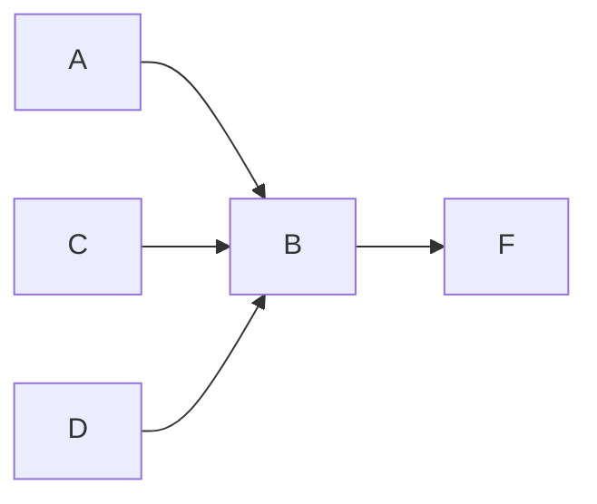

# DAGtags


**Treat your nested tags as a directed acyclic graph. Find any sub-tag, under any parent, straight from Obsidian's core search pane.**

```text
tag:#*/B          →  (tag:#A/B OR tag:#C/B)
tag:#*/B/**       →  (tag:#A/B OR tag:#C/B OR tag:#D/B/F)
tag:#**/B  →  (tag:#B OR tag:#A/C/B OR ...)
```

## Why

Obsidian's nested tags look like a tree, but you rarely use them like one. A sub-tag such as `#personal` or `#B` often sits under several parents:



`#A/B`, `#C/B` and `#D/B/F` all contain the same node `B`. Native search cannot follow it: `tag:` only accepts an exact path, and the usual workaround, a regex such as `#(?:[^/\s]+/)*personal\b`, is clumsy, slow, misses tags declared in frontmatter, and also matches things like `#C/BB`.

DAGtags lets you query by **node** instead of by full path. Type a pattern in the search field, press **Enter**, and it is rewritten into native `tag:` searches. Obsidian does the rest.

### What "DAG" means here

DAGtags does not store, build or modify a graph, and it never touches your notes or tags. On each search it reads every tag path in your vault (inline and frontmatter) and matches your pattern against the path segments. The graph is a way of *thinking* about your tags: each segment is a node, each `/` is a parent-to-child edge, one node can have several parents, and a path never loops back on itself, so the structure is acyclic by construction.

## Features

- Wildcards in the core search pane: `*` for one segment, `**` for any number of segments.
- Finds sub-tags at **any depth** and under **any parent**.
- Works with inline tags and frontmatter tags, using Obsidian's own metadata cache.
- Output is plain native `tag:` syntax, so it combines with every other search operator, `OR`, groups and negation.
- Descendants are de-duplicated: `tag:#A/**` does not list `#A/B` and `#A/B/F` separately, since `tag:#A/B` already covers the latter.
- No internals patched. Only public Obsidian API and one DOM selector are used.
- Nothing is stored, no settings, no network access.

## Usage

Type a tag pattern in the search pane and press **Enter**. Assuming a vault with `#A/B`, `#C/B`, `#D/B/F` and `#personal`:

| You type | Matches | Becomes |
|---|---|---|
| `tag:#*/B` | `A/B`, `C/B` | `(tag:#A/B OR tag:#C/B)` |
| `tag:#*/B/**` | `A/B`, `C/B`, `D/B/F` | `(tag:#A/B OR tag:#C/B OR tag:#D/B/F)` |
| `tag:#**/B` | `B` at any depth, including the root | |
| `tag:#**/B/**` | `B` anywhere in the path, and everything below it | |
| `tag:#proj*/B` | `project/B`, `projects/B` (not `project/x/B`) | |
| `-tag:#*/B` | excludes them all | `-tag:#A/B -tag:#C/B` |
| `foo tag:#*/B -bar` | mixes freely with other terms | `foo (tag:#A/B OR tag:#C/B) -bar` |

### Syntax

| Token | Meaning |
|---|---|
| `*` | Any characters inside **one** segment |
| `**` | **Zero or more** whole segments (must be a complete segment) |

- A pattern must match the **whole** tag. Matching is case-insensitive, like Obsidian tags.
- `tag:#pattern`, `tag:pattern` and a bare `#pattern` are all accepted, each optionally prefixed with `-`. A token is only treated as a pattern if it contains a `*`.
- Write `tag:#pattern` with no space after the colon.
- Text inside `"quotes"` and `/regex/` literals is never touched.
- A trailing or doubled slash (`#*/B/`) is reported as malformed instead of being guessed at.

### Commands

| Command | Description |
|---|---|
| `DAGtags: Expand tag wildcards in the search field` | Does the same as pressing Enter. Useful as a fallback, or to bind to a hotkey. |

## Limitations

- **Descendants are included.** Native `tag:#A/B` also returns notes tagged `#A/B/anything`. Native search cannot exclude descendants, so `tag:#*/B` cannot either.
- **The expansion is a snapshot.** The field shows the expanded query afterwards, so tags created later are not picked up until you retype the pattern.
- **Core search only.** Other search plugins, such as Omnisearch, are not supported yet. They rank tokenised text and have no `tag:` operator, so the same approach does not carry over directly.
- **Relies on the search field's DOM.** If a future Obsidian version changes it, the Enter shortcut stops working and the command above remains as a fallback.

## Installation

Requires Obsidian 1.5.0 or later.

### Option A — with BRAT

1. Install **BRAT** (Beta Reviewer's Auto-update
   Tool) from Obsidian's Community Plugins browser, and enable it.
2. Command palette → **BRAT: Add a beta plugin for testing**, then add
   `Neomoorea/obsidian-daynest`.
3. Enable **DAGtags** under Community plugins.

### Option B — manual install

1. Download `main.js` and `manifest.json` from the [latest release](https://github.com/Neomoorea/obsidian-dagtags/releases/latest).
2. Copy them into `<your vault>/.obsidian/plugins/dagtags/`.
3. Reload Obsidian and enable **DAGtags** under *Settings → Community plugins*.


### Option C — build from source

```bash
git clone https://github.com/Neomoorea/obsidian-dagtags.git
cd obsidian-dagtags
npm install
npm run build     # type-check against the Obsidian typings, then bundle main.js
```

This produces `main.js` and `manifest.json` at the
project root — copy those three files into `.obsidian/plugins/dagtags/`
as above. `npm run dev` runs an incremental watch build if you want to
modify the plugin.

## Licence

MIT — see [LICENSE](LICENSE) for details.
